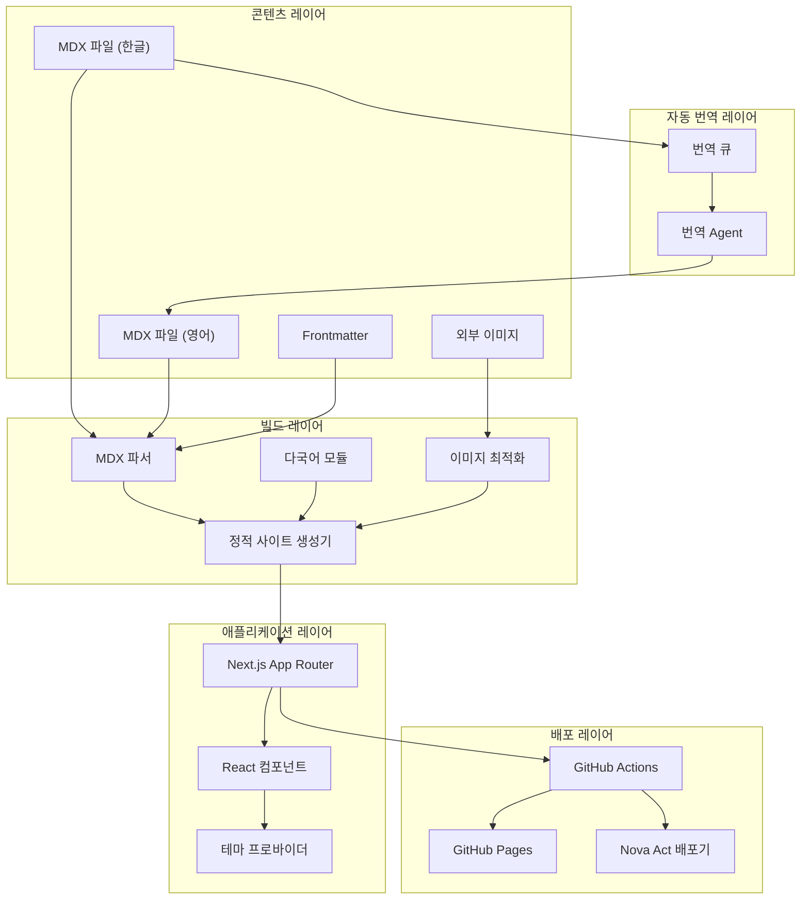

# 설계 문서: 개발자 블로그

## 개요

이 설계 문서는 Next.js 14 App Router와 MDX를 기반으로 한 개인 개발자 블로그 시스템의 아키텍처를 정의합니다. Lee Robinson의 leerob.io를 참고하여 정적 사이트 생성(SSG), 다국어 지원, 외부 이미지 최적화, GitHub Actions 배포, 그리고 Nova Act를 활용한 멀티 채널 배포 기능을 구현합니다.

## 아키텍처



**설계 결정**: 한글 포스트 작성 완료 시 자동으로 번역 Agent에 의뢰하여 영어 버전을 생성합니다. 이를 통해 ko, en 콘텐츠가 항상 동기화되도록 유지합니다.

## 컴포넌트 및 인터페이스

### 1. MDX 콘텐츠 시스템

```typescript
// types/post.ts
interface PostFrontmatter {
  title: string;      // 포스트 제목
  date: string;       // 작성일
  description: string; // 포스트 설명
  tags: string[];     // 태그 목록
  image?: string;     // 대표 이미지 URL (선택)
  locale: 'ko' | 'en'; // 언어
  slug: string;       // URL 슬러그
}

interface Post {
  frontmatter: PostFrontmatter;
  content: string;    // MDX 콘텐츠
  slug: string;       // URL 슬러그
}

// lib/mdx.ts
interface MDX파서 {
  parseFile(filePath: string): Promise<Post>;           // 파일 파싱
  getAllPosts(locale: string): Promise<Post[]>;         // 모든 포스트 조회
  getPostBySlug(slug: string, locale: string): Promise<Post | null>; // 슬러그로 포스트 조회
}

// components/MarkdownRenderer.tsx
// MDX 콘텐츠 내 React 컴포넌트 렌더링 지원
// - 커스텀 컴포넌트 매핑 (ExternalImage, CodeBlock 등)
// - rehype-highlight를 통한 코드 구문 강조
// - remark-gfm을 통한 GitHub Flavored Markdown 지원
interface MDX컴포넌트 {
  [key: string]: React.ComponentType<any>;
}
```

**설계 결정**: MDX 내 React 컴포넌트 렌더링을 위해 `@mdx-js/react`의 MDXProvider를 사용하여 커스텀 컴포넌트를 주입합니다. 이를 통해 요구사항 1.2의 "MDX 파일에 React 컴포넌트가 포함되어 있으면 올바르게 렌더링" 요건을 충족합니다.

### 2. 다국어(i18n) 모듈

```typescript
// lib/i18n.ts
interface 다국어설정 {
  defaultLocale: 'ko' | 'en';  // 기본 언어
  locales: ['ko', 'en'];       // 지원 언어 목록
}

interface 다국어모듈 {
  getLocale(): string;                              // 현재 언어 조회
  setLocale(locale: string): void;                  // 언어 설정
  t(key: string): string;                           // 번역 키로 텍스트 조회
  getTranslations(locale: string): Record<string, string>; // 전체 번역 조회
  detectBrowserLanguage(): 'ko' | 'en';             // 브라우저 언어 감지 (요구사항 3.6)
  getSavedLocale(): string | null;                  // localStorage에서 저장된 언어 조회
  saveLocale(locale: string): void;                 // localStorage에 언어 저장
}

// translations/ko.json, translations/en.json
interface 번역 {
  nav: {
    home: string;    // 홈
    blog: string;    // 블로그
    about: string;   // 소개
  };
  common: {
    readMore: string;     // 더 읽기
    publishedOn: string;  // 게시일
    tags: string;         // 태그
  };
}
```

**설계 결정**: 브라우저 언어 감지를 위해 `navigator.language`를 사용하며, 지원하지 않는 언어의 경우 기본 로케일('ko')로 폴백합니다. 이는 요구사항 3.6의 "저장된 설정 없이 사용자가 방문하면 브라우저 언어를 감지하고 적용" 요건을 충족합니다.

### 3. 이미지 로더 컴포넌트

```typescript
// components/ExternalImage.tsx
interface 외부이미지Props {
  src: string;        // 이미지 URL
  alt: string;        // 대체 텍스트
  width?: number;     // 너비 (선택)
  height?: number;    // 높이 (선택)
  priority?: boolean; // 우선 로딩 여부 (선택)
  fallback?: string;  // 폴백 이미지 경로 (선택)
}

interface 이미지로더설정 {
  domains: string[];      // 허용된 외부 도메인 목록
  deviceSizes: number[];  // 디바이스 크기 목록
  imageSizes: number[];   // 이미지 크기 목록
}
```

**설계 결정**: 외부 이미지는 `unoptimized` 모드로 처리하며, 로딩 실패 시 `/images/placeholder.svg`를 폴백으로 표시합니다. 이는 요구사항 4.2, 4.3을 충족합니다.

### 4. 배포 파이프라인

```typescript
// .github/workflows/deploy.yml (개념적)
interface 배포설정 {
  trigger: 'push' | 'pull_request'; // 트리거 이벤트
  branch: string;                    // 대상 브랜치
  steps: 배포단계[];                  // 배포 단계 목록
}

interface 배포단계 {
  name: string;                      // 단계 이름
  run?: string;                      // 실행 명령어
  uses?: string;                     // 사용할 액션
  with?: Record<string, string>;     // 액션 파라미터
}
```

**설계 결정**: main 브랜치 푸시 시 자동으로 빌드 및 배포가 실행되며, 린팅과 타입 체크를 먼저 수행합니다. node_modules 캐싱으로 빌드 속도를 최적화합니다. 이는 요구사항 5.1, 5.2, 5.5를 충족합니다.

### 5. 멀티 채널 배포기

```typescript
// lib/publisher.ts
interface 배포대상 {
  platform: 'twitter' | 'linkedin' | 'dev.to' | 'medium'; // 플랫폼
  enabled: boolean;                                        // 활성화 여부
  credentials?: Record<string, string>;                    // 인증 정보 (선택)
}

interface 플랫폼제한 {
  twitter: 280;      // 트위터 글자 수 제한
  linkedin: 3000;    // 링크드인 글자 수 제한
  'dev.to': number;  // 제한 없음
  medium: number;    // 제한 없음
}

interface 멀티채널배포기 {
  publish(post: Post, targets: 배포대상[]): Promise<배포결과[]>;     // 배포 실행
  getPublishHistory(slug: string): Promise<배포기록[]>;              // 배포 이력 조회
  formatForPlatform(content: string, platform: keyof 플랫폼제한): string; // 플랫폼별 포맷 변환
}

interface 배포결과 {
  platform: string;   // 플랫폼 이름
  success: boolean;   // 성공 여부
  url?: string;       // 배포된 URL (선택)
  error?: string;     // 오류 메시지 (선택)
  timestamp: string;  // 배포 시간
}

// lib/publishHistory.ts
interface 배포이력관리자 {
  saveRecord(slug: string, result: 배포결과): Promise<void>;                    // 기록 저장
  getRecords(slug: string): Promise<배포기록[]>;                                 // 기록 조회
  logError(platform: string, error: Error, context?: Record<string, any>): void; // 오류 로깅 (요구사항 6.5)
}
```

**설계 결정**: 
- 각 플랫폼별 글자 수 제한(Twitter: 280, LinkedIn: 3000)을 `플랫폼제한` 인터페이스로 명시하여 요구사항 6.3을 충족합니다.
- 채널 배포 실패 시 `logError` 함수를 통해 플랫폼 이름과 오류 메시지를 기록하여 요구사항 6.5를 충족합니다.

### 6. 자동 번역 시스템

```typescript
// lib/translator.ts
interface 번역요청 {
  slug: string;           // 포스트 슬러그
  koContent: string;      // 한글 MDX 콘텐츠
  koFrontmatter: PostFrontmatter; // 한글 Frontmatter
  sourceFile: string;     // 원본 파일 경로
}

interface 번역결과 {
  slug: string;           // 포스트 슬러그
  enContent: string;      // 영어 MDX 콘텐츠
  enFrontmatter: PostFrontmatter; // 영어 Frontmatter
  translatedAt: string;   // 번역 완료 시간
  success: boolean;       // 번역 성공 여부
  error?: string;         // 오류 메시지 (선택)
}

interface 번역Agent {
  requestTranslation(request: 번역요청): Promise<번역결과>; // 번역 의뢰
  getTranslationStatus(slug: string): Promise<'pending' | 'completed' | 'failed'>; // 번역 상태 조회
}

// lib/translationQueue.ts
interface 번역큐 {
  enqueue(request: 번역요청): Promise<void>;                    // 번역 요청 큐에 추가
  dequeue(): Promise<번역요청 | null>;                          // 다음 번역 요청 조회
  markCompleted(slug: string, result: 번역결과): Promise<void>; // 번역 완료 표시
  getQueueStatus(): Promise<{ pending: number; completed: number }>; // 큐 상태 조회
}

// lib/translationHook.ts
interface 번역Hook {
  onKoPostCreated(filePath: string): Promise<void>;  // 한글 포스트 생성 시 트리거
  onKoPostUpdated(filePath: string): Promise<void>;  // 한글 포스트 수정 시 트리거
  syncTranslations(): Promise<void>;                 // 번역 동기화 실행
}
```

**설계 결정**: 
- 한글 포스트 작성/수정 완료 시 자동으로 번역 Agent에 의뢰합니다.
- 번역 큐를 통해 비동기 처리로 블로그 빌드 성능에 영향을 주지 않습니다.
- Kiro Hook을 활용하여 파일 저장 시 자동으로 번역 프로세스를 트리거합니다.
- 이를 통해 ko, en 콘텐츠가 항상 동기화되도록 유지합니다.

## 데이터 모델

### 포스트 콘텐츠 구조

```
content/
├── posts/
│   ├── ko/                    # 한국어 포스트
│   │   ├── first-post.mdx
│   │   └── second-post.mdx
│   └── en/                    # 영어 포스트
│       ├── first-post.mdx
│       └── second-post.mdx
└── pages/
    ├── ko/                    # 한국어 페이지
    │   └── about.mdx
    └── en/                    # 영어 페이지
        └── about.mdx
```

### MDX Frontmatter 스키마

```yaml
---
title: "포스트 제목"
date: "2024-01-15"
description: "포스트 설명"
tags: ["nextjs", "react", "blog"]
image: "https://external-image.com/image.jpg"
locale: "ko"
---
```

### 데이터베이스 스키마 (로컬 JSON)

```typescript
// data/publish-history.json
interface 배포이력 {
  posts: {
    [slug: string]: {
      publishedAt: string;      // 최초 게시일
      channels: {
        platform: string;       // 플랫폼 이름
        publishedAt: string;    // 배포 시간
        url: string;            // 배포된 URL
      }[];
    };
  };
}
```

## 정확성 속성

*정확성 속성(Correctness Property)은 시스템의 모든 유효한 실행에서 참이어야 하는 특성입니다. 이는 사람이 읽을 수 있는 명세와 기계가 검증할 수 있는 정확성 보장 사이의 다리 역할을 합니다.*

### 속성 1: MDX 파싱 라운드 트립

*모든* 유효한 frontmatter가 포함된 MDX 콘텐츠에 대해, 콘텐츠를 파싱하고 frontmatter 메타데이터를 추출하면 원본 frontmatter 필드(title, date, description, tags)가 정확한 값으로 보존된 객체가 생성되어야 합니다.

**검증 대상: 요구사항 1.1, 1.3**

### 속성 2: MDX 구문 오류 처리

*모든* 잘못된 구문이 포함된 MDX 콘텐츠에 대해, MDX_파서는 조용히 실패하거나 손상된 출력을 생성하는 대신 설명적인 오류 메시지와 함께 오류를 발생시켜야 합니다.

**검증 대상: 요구사항 1.5**

### 속성 3: 정적 라우팅 완전성

*모든* 유효한 슬러그를 가진 content 디렉토리의 MDX 파일에 대해, 정적 사이트 생성기는 해당 슬러그에 매핑되는 라우트를 생성해야 하며, 생성된 라우트의 총 수는 유효한 MDX 파일 수와 같아야 합니다.

**검증 대상: 요구사항 2.1, 2.4**

### 속성 4: 다국어 콘텐츠 구조 일관성

*모든* 한국어와 영어 버전이 모두 존재하는 블로그 포스트에 대해, 두 버전은 동일한 슬러그 식별자를 공유해야 하며, 언어 전환 시 현재 페이지 경로가 유지되어야 합니다(로케일 접두사만 변경).

**검증 대상: 요구사항 3.2, 3.4**

### 속성 5: 언어 설정 지속성 (라운드 트립)

*모든* 유효한 언어 코드('ko' 또는 'en')에 대해, localStorage에 저장한 후 다시 조회하면 정확히 동일한 언어 코드가 반환되어야 합니다.

**검증 대상: 요구사항 3.5**

### 속성 6: 이미지 로딩 폴백

*모든* 유효하지 않거나 접근할 수 없는 외부 이미지 URL에 대해, 이미지_로더는 처리되지 않은 오류를 발생시키지 않고 폴백 플레이스홀더 경로를 반환해야 합니다.

**검증 대상: 요구사항 4.3**

### 속성 7: SEO 메타데이터 완전성

*모든* 유효한 frontmatter가 있는 블로그 포스트에 대해, 생성된 HTML에는 포스트 제목과 일치하는 title 메타 태그, description 메타 태그, Open Graph 태그(og:title, og:description, og:image), canonical URL이 포함되어야 합니다.

**검증 대상: 요구사항 8.1, 8.2, 8.4**

### 속성 8: 멀티채널 포맷 변환

*모든* 블로그 포스트 콘텐츠에 대해, 대상 플랫폼 형식(Twitter, LinkedIn 등)으로 변환하면 플랫폼의 글자 수 제한을 초과하지 않고 핵심 메시지가 보존된 유효한 출력이 생성되어야 합니다.

**검증 대상: 요구사항 6.3**

### 속성 9: 배포 이력 추적 (라운드 트립)

*모든* 배포 기록(포스트 슬러그, 플랫폼, 타임스탬프)에 대해, 저장한 후 해당 슬러그의 배포 이력을 조회하면 원본 플랫폼과 타임스탬프가 포함된 기록이 반환되어야 합니다.

**검증 대상: 요구사항 6.4**

### 속성 10: 자동 번역 완전성

*모든* 한글 포스트에 대해, 번역 Agent를 통해 번역 의뢰 후 완료되면 영어 버전이 `content/posts/en/` 디렉토리에 생성되어야 하며, 영어 버전의 frontmatter는 한글 버전과 동일한 슬러그를 가져야 합니다.

**검증 대상: 설계 방향 - 자동 번역 시스템**

### 속성 11: 번역 콘텐츠 일관성 (라운드 트립)

*모든* 번역된 포스트에 대해, 한글 포스트의 핵심 정보(제목, 설명, 태그)를 영어로 번역한 후 다시 한글로 역번역하면 원본과 의미적으로 동등해야 합니다.

**검증 대상: 설계 방향 - 자동 번역 시스템**

## 오류 처리

### MDX 파싱 오류

```typescript
class MDX파싱오류 extends Error {
  constructor(
    message: string,
    public filePath: string,
    public line?: number
  ) {
    super(`MDX 파싱 오류 (${filePath}): ${message}`);
  }
}
```

### 이미지 로딩 오류

```typescript
// 이미지 로딩 실패 시 폴백 처리
const handleImageError = (error: Error, src: string) => {
  console.error(`이미지 로딩 실패: ${src}`, error);
  return '/images/placeholder.svg';
};
```

### 배포 오류

```typescript
// GitHub Actions에서 빌드 실패 시 알림
interface 빌드오류 {
  step: string;      // 실패한 단계
  message: string;   // 오류 메시지
  exitCode: number;  // 종료 코드
}
```

### 멀티채널 배포 오류

```typescript
// 채널 배포 실패 시 오류 로깅
const logPublishError = (platform: string, error: Error) => {
  console.error(`[${platform}] 배포 실패: ${error.message}`);
  // data/publish-history.json에 오류 기록
};
```

## 테스트 전략

### 단위 테스트

- MDX 파서의 frontmatter 추출 테스트
- 다국어 모듈의 번역 키 조회 테스트
- 이미지 URL 유효성 검사 테스트
- 플랫폼별 글자 수 제한 검증 테스트
- 번역 요청 큐 추가/제거 테스트
- 번역 결과 저장 및 조회 테스트
- 한글/영어 포스트 슬러그 일관성 테스트

### 속성 기반 테스트

- **속성 1**: MDX frontmatter 파싱 라운드 트립 검증
- **속성 2**: MDX 구문 오류 처리 검증
- **속성 3**: 정적 라우팅 완전성 검증
- **속성 4**: 다국어 콘텐츠 구조 일관성 검증
- **속성 5**: 언어 설정 지속성 검증
- **속성 6**: 이미지 로딩 폴백 검증
- **속성 7**: SEO 메타데이터 완전성 검증
- **속성 8**: 멀티채널 포맷 변환 검증
- **속성 9**: 배포 이력 추적 검증
- **속성 10**: 자동 번역 완전성 검증
- **속성 11**: 번역 콘텐츠 일관성 검증

### 통합 테스트

- 전체 빌드 프로세스 테스트
- GitHub Actions 워크플로우 테스트
- 정적 페이지 생성 및 라우팅 테스트

### 테스트 프레임워크

- **Jest**: 단위 테스트 및 속성 기반 테스트
- **fast-check**: 속성 기반 테스트 라이브러리
- **Playwright**: E2E 테스트 (선택적)

각 속성 기반 테스트는 최소 100회 반복 실행하며, 다음 형식으로 태그합니다:
```typescript
// Feature: developer-blog, 속성 1: MDX 파싱 라운드 트립
```
